# LABMedical
### _Sistema de Gestão Hospitalar_

O LABMedical é um software audacioso para gestão de instituições médicas. A partir do LABMedical, é possível fazer a gestão da entrada de pacientes, e registrar todas as suas interações na instituição.

 A gestão de usuários disponível no LABMedical aumenta a segurança e confiabilidade do sistema, restringindo o acesso dos usuários somente à suas áreas de competência.

Cada registro feito no sistema também gera um Log, permitindo que o administrador verifique as alterações feitas nos cadastros do sistema.

Outra função disponível no sistema é o Prontuário Eletrônico do Paciente. Esta função robusta permite cadastrar consultas, exames, medicamentos, dietas e exercícios do paciente. E possui também uma visão simplificada do prontuário que detalha os dados médicos do paciente em ordem cronológica.

Um dos grandes diferenciais do sistema LABMedical é a sua capacidade de se adaptar à identidade visual da instituição médica. Com a função de customização do sistema, é possível alterar as cores e logos, para o que sistema LABMedical se adapte em qualquer instituição.

## Índice

1.  [Instalação](#instalacao)
2. [Login](#login)
3. [Estatísticas do Sistema](#stats)
4. [Logs do Sistema](#logs)
5. [Customização do Sistema](#custom)
6. [Cadastro de Usuários](#users)
7. [Cadastro de Pacientes](#pacientes)
8. [Prontuário Eletrônico do Paciente](#prontuario)\
5.1 [Barra de Pacientes](#barra)\
5.2 [Cadastro de Consultas](#consultas)\
5.3 [Cadastro de Exames](#exames)\
5.4 [Cadastro de Medicação](#medicacao)\
5.5 [Cadastros de Dietas](#dietas)\
5.6 [Cadastros de Exercícios](#exercicios)\
5.7 [Visão Simplificada](#visao)

## Instalação<a id="instalacao"><a>

O sistema foi desenvolvido com o framework Angular, portanto os seguintes comandos são necessário para instalar e rodar a aplicação

```sh
cd lab-medical
npm i
npm i ngx-bootstrap
npm start
```
## Login<a id="login"><a>

Para criar novos usuários no sistema, é necessário entrar em contato com o administrador. Ao clicar no botão "Cadastrar novo Usuário", a seguinte mensagem será mostrada:
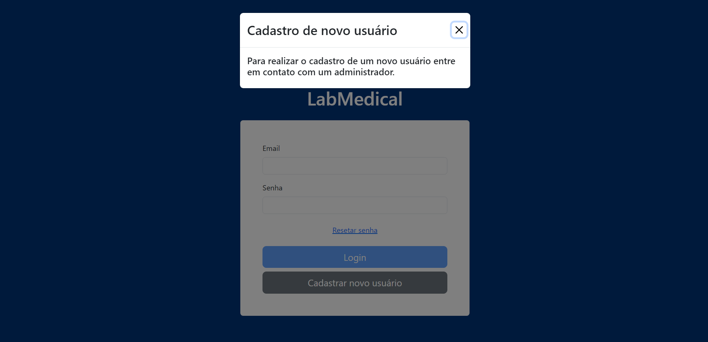

Após receber o novo usuário e senha, é possível acessar o sistema.

Caso o usuário perca sua senha, ele pode clicar no botão "Resetar senha", onde após preencher o email, a seguinte mensagem será mostrada:
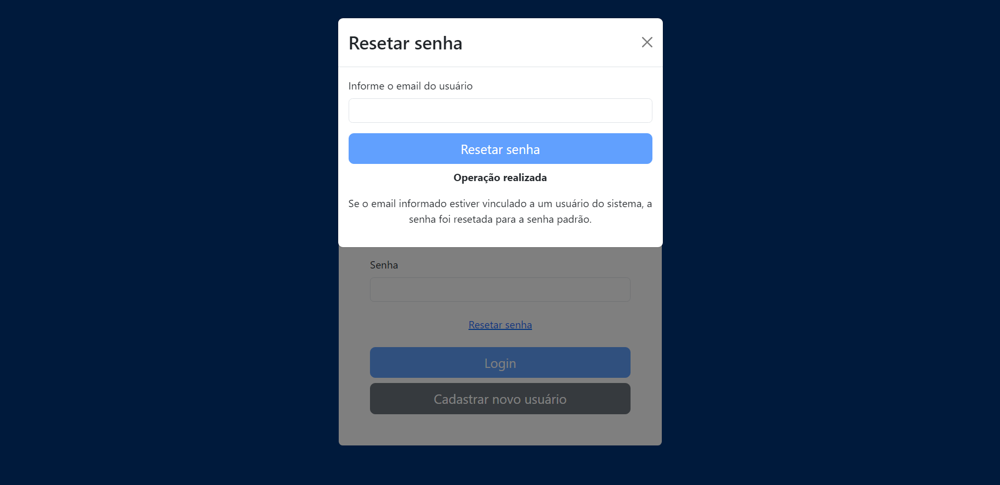


## Estatísticas do Sistema<a id="stats"><a>
A tela inicial do sistema exibe as estatísticas do sistema. Os cards superiores mostram a quantidade de pacientes, usuários, consultas, exames, medicamentos, dietas e exercícios cadastrados. Os painéis superiores mostram as listas de usuários e pacientes cadastrados, permitindo acessar os registros individuais.
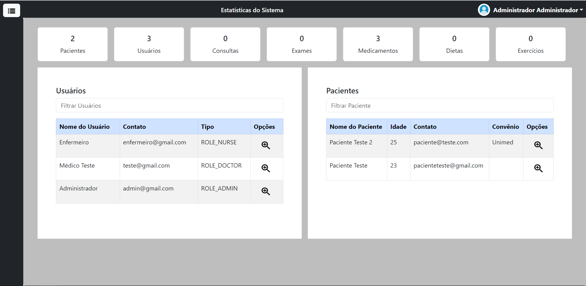

## Logs do Sistema<a id="logs"><a>

Todas as ações realizadas no sistema geram um log, informando o timestamp do ocorrido, uma mensagem descritiva e também informa se ocorreu um erro ao tentar realizar a ação. Esta função só está disponível para usuários administradores.
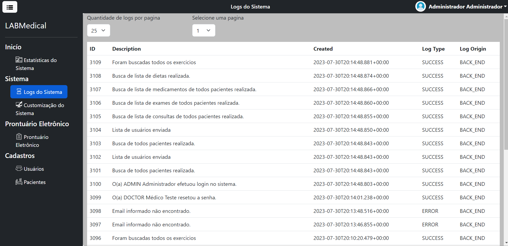

## Cadastro de Usuários<a id="users"><a>

Para trocar entre as funções do sistema, abrir o menu de navegação e escolher a função desejada. Neste exemplo, escolher a função "Cadastro de Usuários". Esta função só está disponível para usuários administradores.
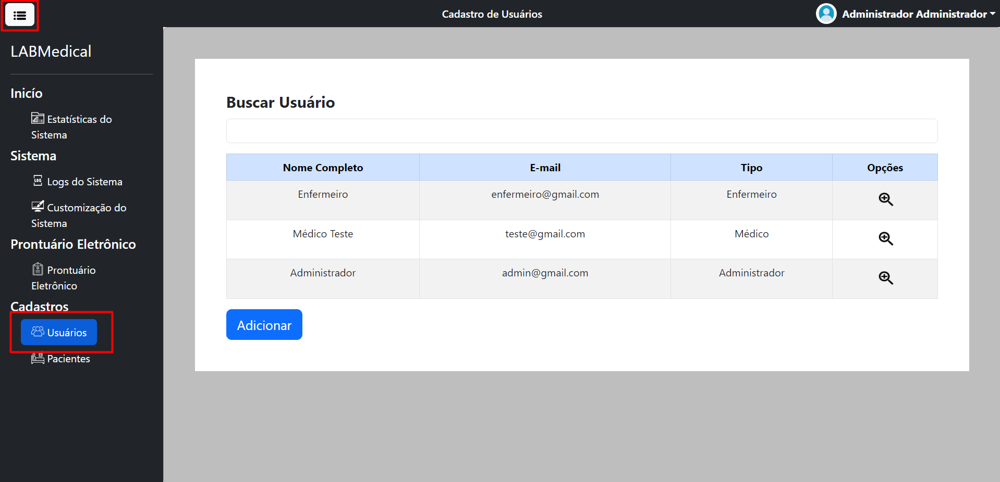

A tela da Cadastro de Usuários possui 3 seções principais: A barra de Buscar Usuário, que irá filtrar o usuário cadastrados por nome ou email; A tabela com as informações dos usuários cadastrados; E o botão "Adicionar" que permite criar um novo registro.
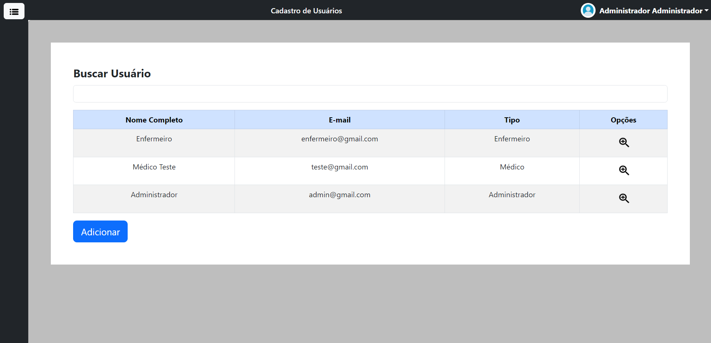

Ao clicar em "Adicionar" o formulário de cadastro de usuários será aberto. Os campos com asteriscos vermelhos indicam campos obrigatórios.
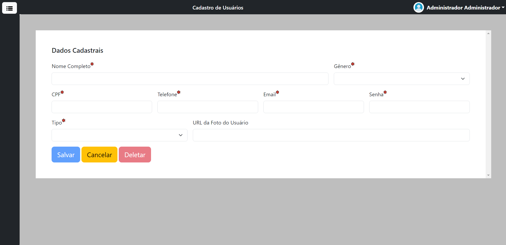

Após clicar no botão de "Adicionar" o usuário será cadastrado, e o sistema retornará à página de usuários cadastrados, e agora a tabela terá o novo registro. Ao clicar no ícone da lupa na coluna "Opções" o sistema abrirá novamente o formulário, mas agora com os dados já cadastrados do usuário, e com os botões "Salvar" e "Excluir" habilitados.
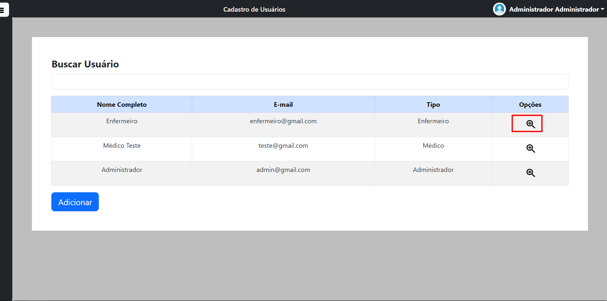
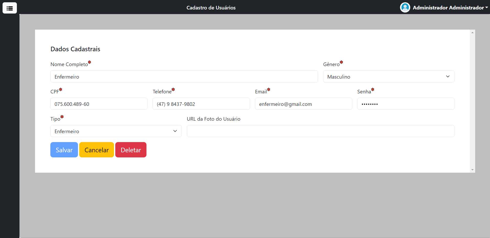

## Cadastro de Pacientes<a id="pacientes"><a>

Para acessar a função Cadastro de Pacientes, abrir o menu de navegação e selecionar a função.
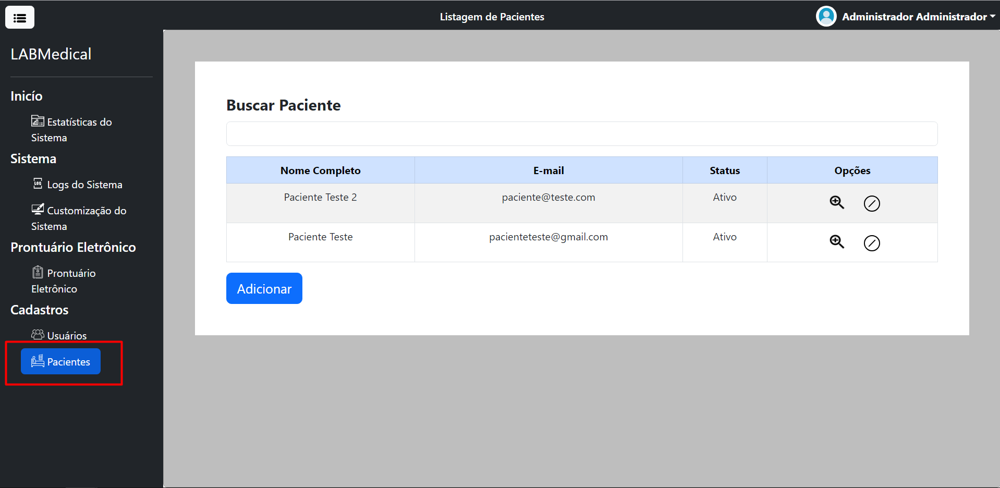

A tela da Cadastro de Paciente possui 3 seções principais: A barra de Buscar Paciente, que era filtrar os pacientes cadastrados por nome, email ou telefone; A tabela com as informações dos pacientes cadastrados; E o botão "Adicionar" que permite criar um novo registro.
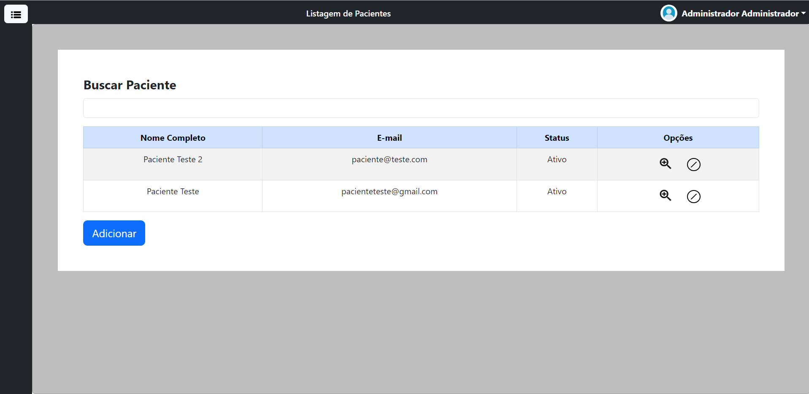
Ao clicar em "Adicionar" o formulário de cadastro de paciente será aberto. Este formulário é dividido nas seções de Identificação, Informações complementares, Convênio e Endereço. Os campos com asteriscos vermelhos indicam campos obrigatórios.
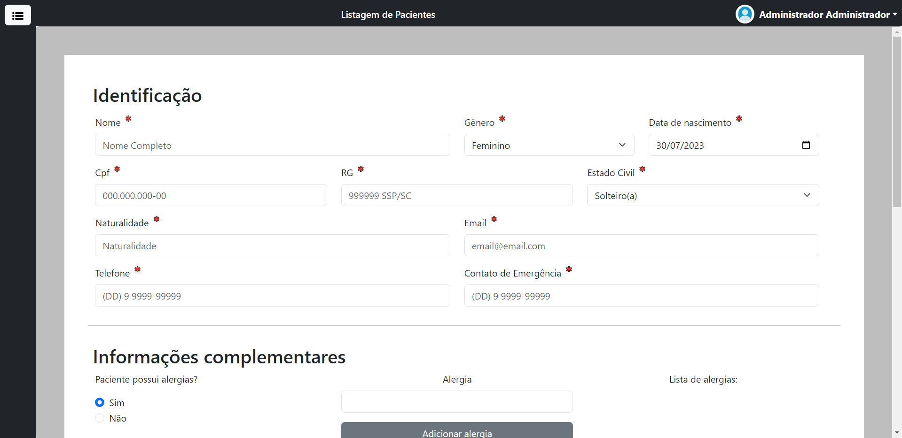

Na seção de Endereço, ao preencher o campo de CEP, o sistema utiliza a API ViaCEP para trazer dados de endereço, mas ainda permite que o usuário cadastre eventuais dados não cadastrados na API, como número e complemento.
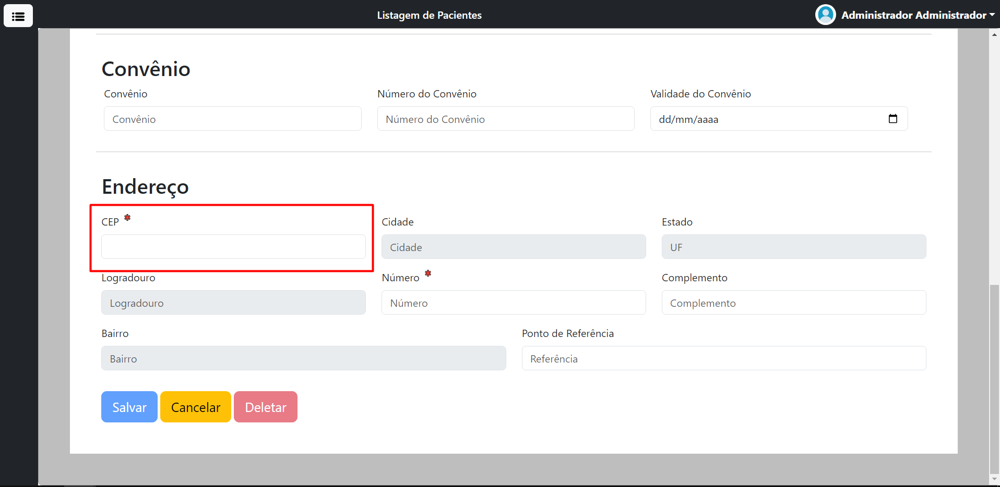
Após clicar no botão de "Adicionar" o paciente será cadastrado, e o sistema retornará à página de pacientes cadastrados, e agora a tabela terá o registro. Ao clicar no ícone da lupa na coluna "Opções" o sistema abrirá novamente o formulário, mas agora com os dados já cadastrados do paciente, e com os botões "Salvar" e "Excluir" habilitados.
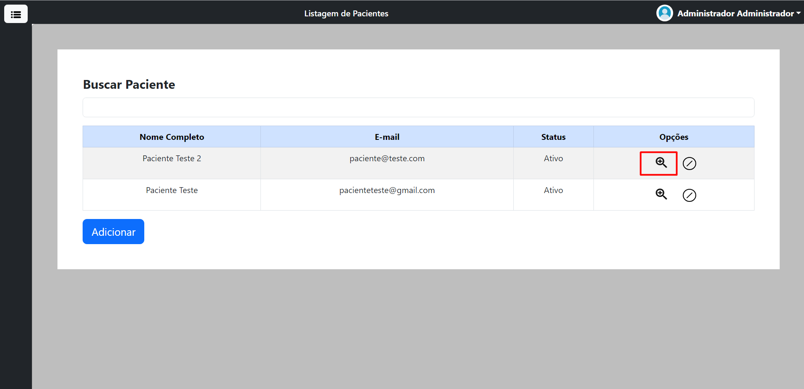
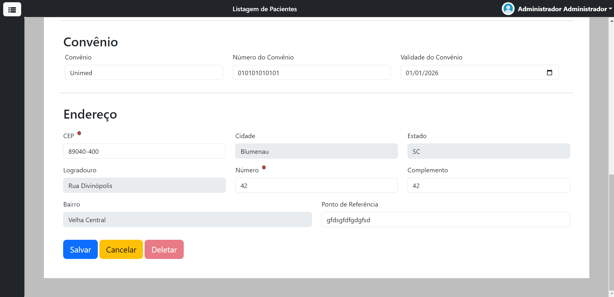
O registro de um paciente só poder ser excluído se o mesmo não possuir Consultas, Exames, Medicações, Dietas ou Exercícios cadastrados.
## Prontuário Eletrônico do Paciente<a id="prontuario"><a>
Para acessar a função de Prontuário Eletrônico do Paciente, abrir o menu de navegação e selecionar a função.
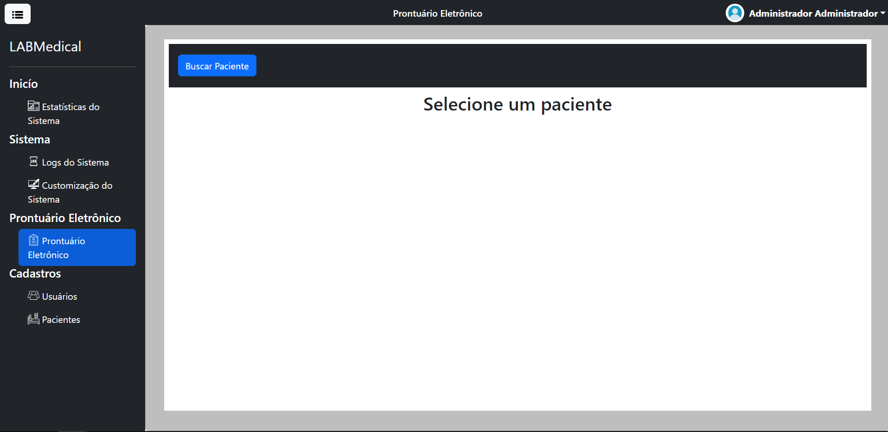
### Barra de Pacientes<a id="barra"><a>
Para acessar as funcionalidades do Prontuário Eletrônico, é necessário que seja selecionado um paciente. Para isso, é necessário clicar no botão "Buscar Paciente".
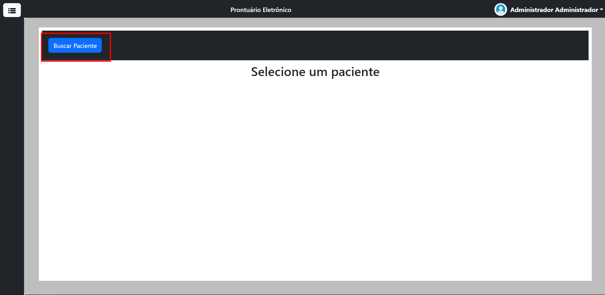
Ao clicar no botão, um modal será aberto, ele possui uma barra para pesquisa de pacientes por nome, e uma lista com todos os pacientes cadastrados. Para selecionar o paciente clicar na opção "Selecionar".
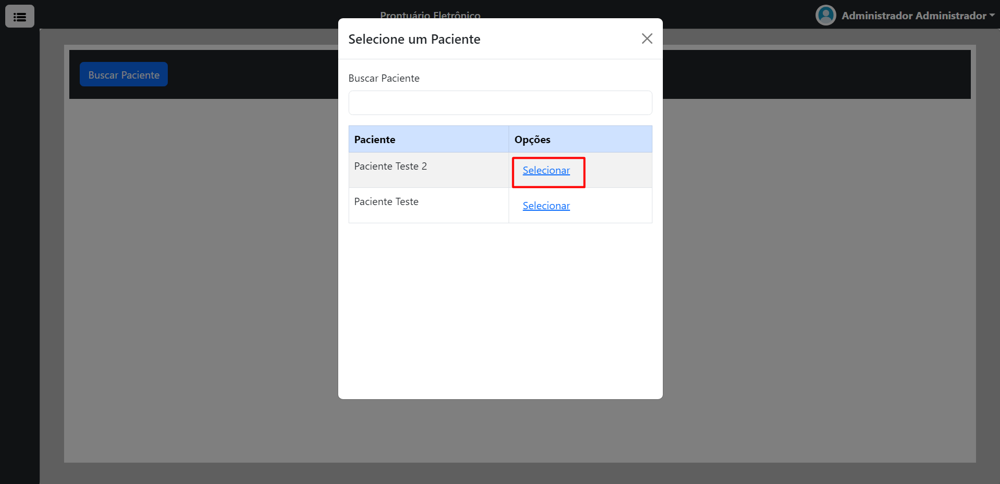
Ao selecionar um paciente, suas informações cadastradas serão preenchidas automaticamente na barra de paciente, e as funcionalidades do Prontuário Eletrônico serão liberadas. Ao clicar no ícone de retorno na barra, o paciente atual é removido, permitindo selecionar um outro paciente.
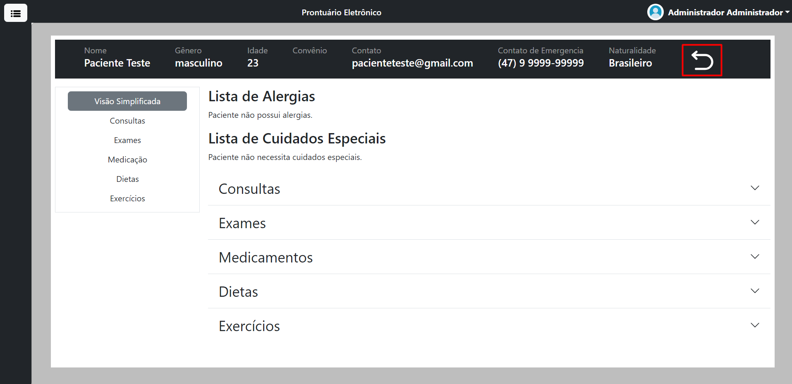
### Cadastro de Consultas<a id="consultas"><a>
Ao clicar na opção "Consultas" o sistema mostrará a tela de Cadastro de Consultas. Clicando no botão "Adicionar" é possível adicionar nova consulta. Esta tela só pode ser acessada por usuários administradores ou médicos.
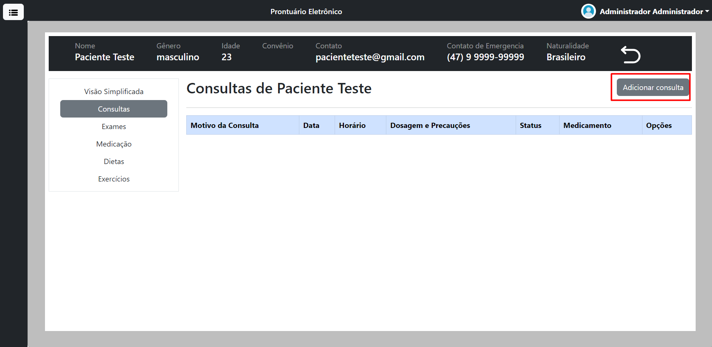
Ao clicar no botão "Adicionar" será aberto o formulário de cadastro de consulta, onde o sistema já traz os campos de data e hora preenchidos com o horário atual. Os campos com asteriscos vermelhos indicam campos obrigatórios.

Da mesma forma que os outros cadastros, ao clicar no botão "Adicionar" o sistema irá mostrar uma tabela com todos os registros cadastrados. Ao clicar no ícone da lupa na coluna "Opções" o sistema abrirá novamente o formulário, mas agora com os dados já cadastrados da consulta, e com os botões "Salvar" e "Excluir" habilitados.
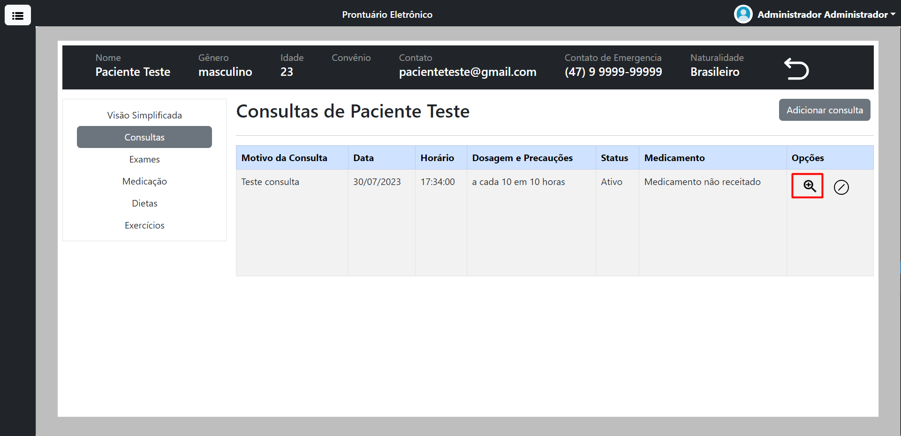
Ao clicar no ícone de inativação na coluna "Opções", o registro será inativado.
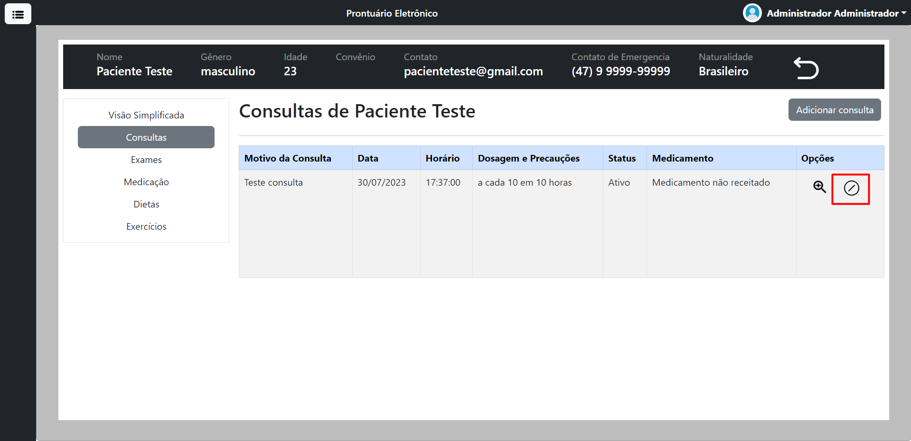
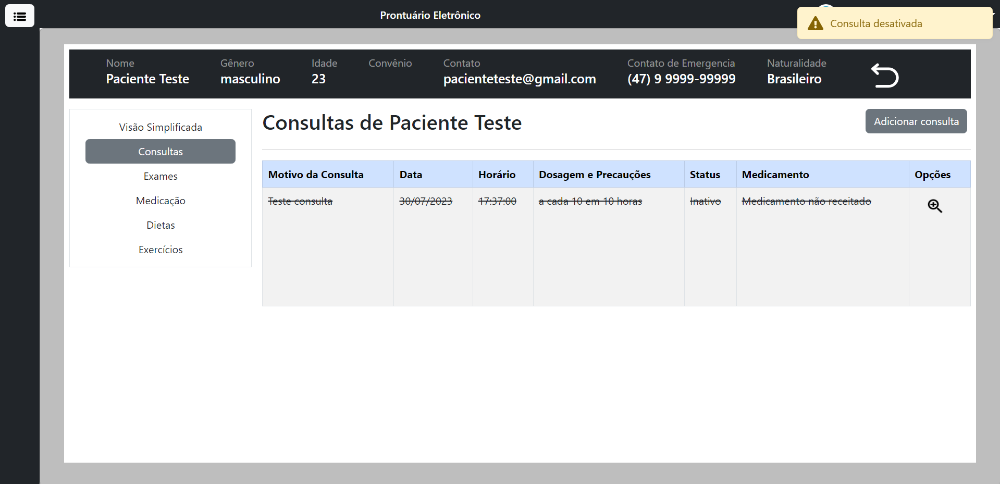

### Cadastro de Exames<a id="exames"><a>
Ao clicar na opção "Exames" o sistema mostrará a tela de Cadastro de Exames. Clicando no botão "Adicionar" é possível adicionar novo exame. Esta tela só pode ser acessada por usuários administradores ou médicos.

Ao clicar no botão "Adicionar" será aberto o formulário de cadastro de exame, onde o sistema já traz os campos de data e hora preenchidos com o horário atual. Os campos com asteriscos vermelhos indicam campos obrigatórios.

Da mesma forma que os outros cadastros, ao clicar no botão "Adicionar" o sistema irá mostrar uma tabela com todos os registros cadastrados. Ao clicar no ícone de anexo, o sistema irá abrir o anexo cadastrado. Ao clicar no ícone da lupa na coluna "Opções" o sistema abrirá novamente o formulário, mas agora com os dados já cadastrados do exame, e com os botões "Salvar" e "Excluir" habilitados.

Ao clicar no ícone de inativação na coluna "Opções", o registro será inativado.

### Cadastro de Medicação<a id="medicacao"><a>
Ao clicar na opção "Medicação" o sistema mostrará a tela de Cadastro de Medicamentos. Clicando no botão "Adicionar" é possível adicionar novo medicamento.

Ao clicar no botão "Adicionar" será aberto o formulário de cadastro de medicamento, onde o sistema já traz os campos de data e hora preenchidos com o horário atual. Os campos com asteriscos vermelhos indicam campos obrigatórios.

Da mesma forma que os outros cadastros, ao clicar no botão "Adicionar" o sistema irá mostrar uma tabela com todos os registros cadastrados. Ao clicar no ícone da lupa na coluna "Opções" o sistema abrirá novamente o formulário, mas agora com os dados já cadastrados do exame, e com os botões "Salvar" e "Excluir" habilitados.

Ao clicar no ícone de inativação na coluna "Opções", o registro será inativado.

### Cadastro de Dietas<a id="dietas"><a>
Ao clicar na opção "Dietas" o sistema mostrará a tela de Cadastro de Dietas. Clicando no botão "Adicionar" é possível adicionar uma nova dieta.

Ao clicar no botão "Adicionar" será aberto o formulário de cadastro de dietas, onde o sistema já traz os campos de data e hora preenchidos com o horário atual. Os campos com asteriscos vermelhos indicam campos obrigatórios.

Da mesma forma que os outros cadastros, ao clicar no botão "Adicionar" o sistema irá mostrar uma tabela com todos os registros cadastrados. Ao clicar no ícone da lupa na coluna "Opções" o sistema abrirá novamente o formulário, mas agora com os dados já cadastrados do exame, e com os botões "Salvar" e "Excluir" habilitados.

Ao clicar no ícone de inativação na coluna "Opções", o registro será inativado.

### Cadastro de Exercícios<a id="exercicios"><a>
Ao clicar na opção "Exercicios" o sistema mostrará a tela de Cadastro de Exercícios. Clicando no botão "Adicionar" é possível adicionar novo exercício.

Ao clicar no botão "Adicionar" será aberto o formulário de cadastro de exercícios, onde o sistema já traz os campos de data e hora preenchidos com o horário atual. Os campos com asteriscos vermelhos indicam campos obrigatórios.

Da mesma forma que os outros cadastros, ao clicar no botão "Adicionar" o sistema irá mostrar uma tabela com todos os registros cadastrados. Ao clicar no ícone da lupa na coluna "Opções" o sistema abrirá novamente o formulário, mas agora com os dados já cadastrados do exame, e com os botões "Salvar" e "Excluir" habilitados.

Ao clicar no ícone de inativação na coluna "Opções", o registro será inativado.


### Visão Simplificada<a id="visao"><a>
Ao clicar na opção "Visão Simplificada" o sistema mostrará a tela de Visão Simplificada do Prontuário. Esta tela possuí todas as informações médicas do paciente, como Alergias e Cuidados Específicos. A tela apresenta também as consultas, exames, medicações, dietas e exercícios cadastrados para o paciente, em ordem cronológica. Ao clicar no ícone de anexo, nos exames que possuem anexo cadastrado,  o sistema irá abrir o anexo cadastrado. Ao clicar no botão "Acessar", o sistema irá abrir o respectivo formulário.
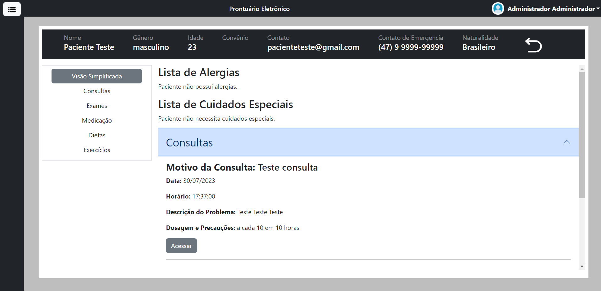